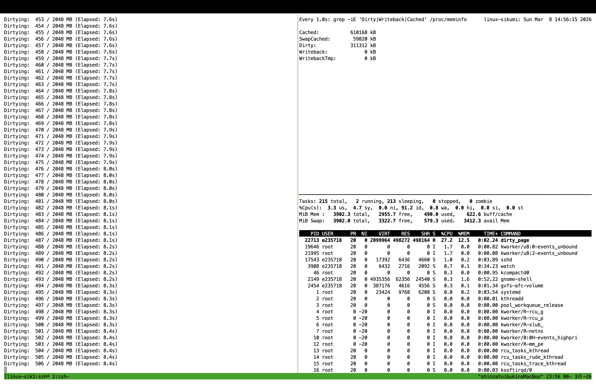

# Dirty Page Experiment

### ⚠️ Linux環境での実験を想定しております。

`mmap` を使用してファイルをメモリにマッピングし、意図的に **Dirty Page**（メモリ上で書き換えられたが、まだディスクに反映されていないページ）を作成します。Dirty Page が大量に発生した際の Linux カーネルの挙動（書き戻しアルゴリズムやプロセスへのブレーキ）を観察・実験するためのプログラムです。

## 準備

実行前にプログラムをリリースモードでビルドしてください。

```bash
$ cargo build --release
$ chmod +x run.sh
```

## 実行方法

メインスクリプトを実行すると、キャッシュのクリア、プログラムの実行、同期が自動で行われます。
```bash
$ ./run.sh
```

実験中、別のターミナルで以下のコマンドを実行することで、カーネルのメモリ統計をリアルタイムに監視できます。

```bash

$ watch -n 1 "grep -iE 'Dirty|Writeback|Cached' /proc/meminfo"
```

## 観察ポイント

- Dirty の増加: Rustプログラムがメモリを書き換えるにつれ、Dirty の数値がリアルタイムで上昇します。

- Writeback の発生: ページキャッシュが一定の閾値（vm.dirty_background_ratio 等）に達した瞬間、カーネルが裏側でディスクへの書き出しを開始し、Writeback の数値が変動し始めます。

- OSの書き込み抑制: さらに Dirty Page が増え続けると、OSがプロセスの書き込み速度にブレーキ（スロットリング）をかける挙動が観察できます。

## 実行画面
